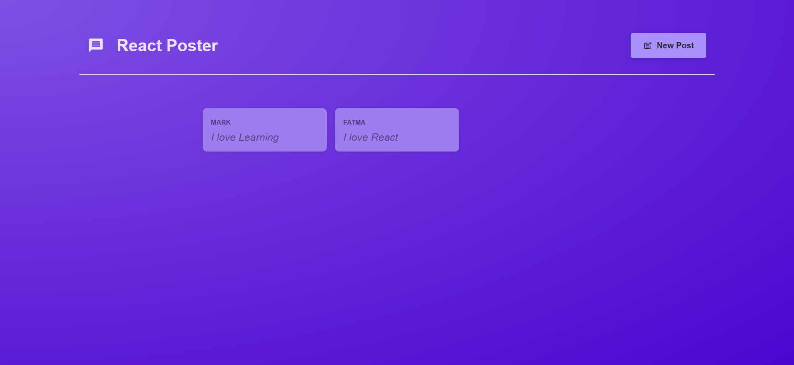
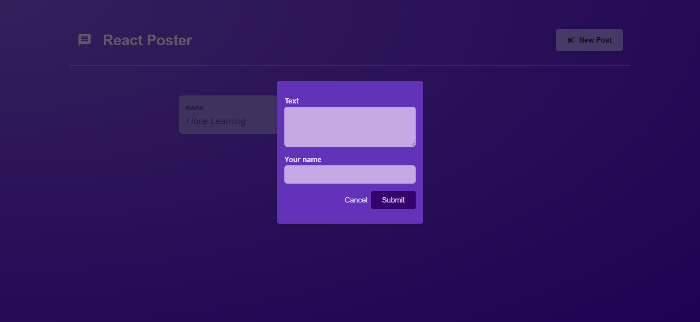
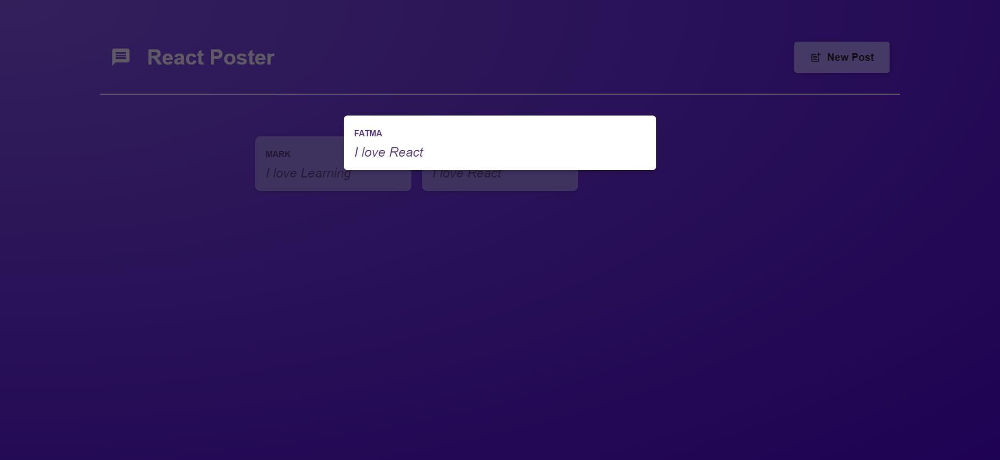

# React Poster App

Welcome to the React Poster app! This app allows users to create, view, and manage posts. It's a simple and intuitive way to share information and engage with your community.

## Features

- **Create Posts**: Users can easily create new posts. Just fill in the details, and your post will be live in seconds.

- **View Post Details**: Click on a post to view more details, including the post content and author information.

- **User-Friendly Interface**: The app features a clean and user-friendly interface, making it easy for users to navigate and interact.

 ## Usage

- Create a new post by clicking the "New Post" button.
- Click on a post to view its details.
- Interact with the app to manage and explore posts as needed.

## Technologies Used

- **React**: The app is built using the React library, providing a powerful and flexible frontend framework.
- **React Router**: Used for client-side routing, enabling seamless navigation within the app.

## Installation

To run this app locally, follow these steps:
- Clone the repository to your local machine
- cd react-poster-app
- cd frontend
- npm install
- npm start
